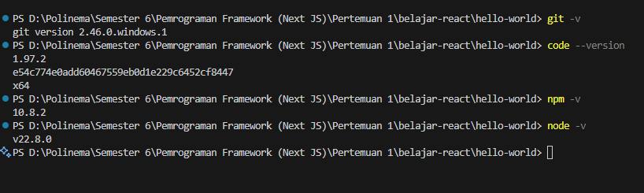
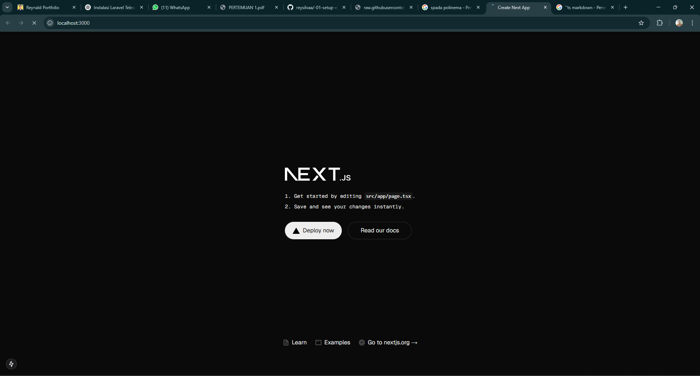
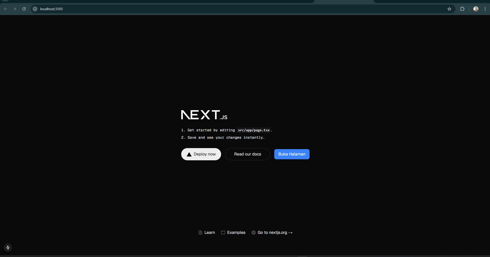
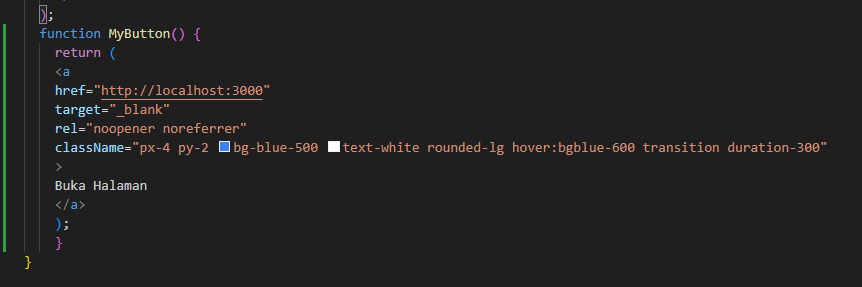
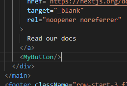
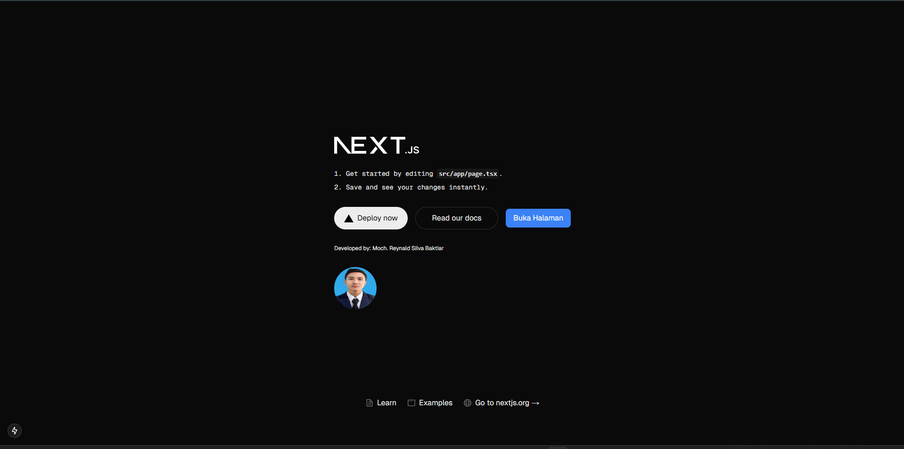

# Next.js Project

This is a [Next.js](https://nextjs.org) project bootstrapped with [`create-next-app`](https://nextjs.org/docs/app/api-reference/cli/create-next-app).

## Getting Started

Run the development server:

```bash
npm run dev
# or
yarn dev
# or
pnpm dev
# or
bun dev
```

Open [http://localhost:3000](http://localhost:3000) in your browser to see the result.

You can start editing the page by modifying `app/page.tsx`. The page auto-updates as you edit the file.

This project uses [`next/font`](https://nextjs.org/docs/app/building-your-application/optimizing/fonts) to automatically optimize and load [Geist](https://vercel.com/font), a new font family for Vercel.

---

## Laporan Praktikum

### Identitas

|  | Pemrograman Berbasis Framework 2025 |
|--|--|
| **NIM** | 2241720203 |
| **Nama** | Moch Reynald Silva Baktiar |
| **Kelas** | TI - 3A |

---

## **Jawaban Praktikum 1**

##### 1. Jelaskan kegunaan masing-masing dari Git, VS Code dan NodeJS yang telah Anda install pada sesi praktikum ini!
- **Git**: Version Control System (VCS) untuk mengelola dan melacak perubahan kode sumber.
- **VS Code**: Editor kode yang ringan dan memiliki banyak ekstensi pendukung pengembangan.
- **Node.js**: Runtime environment untuk menjalankan JavaScript di sisi server, digunakan untuk pengembangan backend.

##### 2. Buktikan dengan screenshoot yang menunjukkan bahwa masing-masing tools tersebut telah berhasil terinstall di perangkat Anda!


---

## **Jawaban Praktikum 2**

##### 1. Pada Langkah ke-2, setelah membuat proyek baru menggunakan Next.js, terdapat beberapa istilah yang muncul. Jelaskan istilah tersebut, TypeScript, ESLint, Tailwind CSS, App Router, Import alias, App router, dan Turbopack!
- **TypeScript**: JavaScript yang lebih aman karena bisa mengecek kesalahan kode sebelum dijalankan.
- **ESLint**: Alat untuk memastikan kode tetap rapi dan bebas dari kesalahan.
- **Tailwind CSS**: Framework CSS yang mempermudah styling dengan utility classes.
- **App Router**: Struktur baru Next.js untuk mengatur halaman, seperti dibawah ini direktorinya nantinya.
```dir
📂 app
┣ 📂 about
┃ ┗ 📄 page.tsx  // Halaman About
┗ 📄 page.tsx    // Halaman utama
```
- **Import Alias (@/)**: Mempermudah import dengan format lebih singkat.
  ```tsx
  import Button from "@/components/Button";
  ```
- **Turbopack**: Tool untuk mempercepat build dan reload Next.js.

##### 2. Apa saja kegunaan folder dan file yang ada pada struktur proyek React yang tampil pada gambar pada tahap percobaan ke-3!

- 📂 **.next/** → Folder hasil build Next.js.
- 📂 **laporan/** → Berisi file laporan/screenshot.
- 📂 **node_modules/** → Library proyek (`npm install`).
- 📂 **public/** → File statis (gambar, ikon, font).
- 📂 **src/** → Kode utama aplikasi.
- 📝 **Konfigurasi:** `.gitignore`, `eslint.config.mjs`, `next.config.ts`, `package.json`, `postcss.config.mjs`, `tailwind.config.ts`, `tsconfig.json`.

##### 3. Buktikan dengan screenshoot yang menunjukkan bahwa tahapan percobaan di atas telah berhasil Anda lakukan!


---

## **Jawaban Praktikum 3**

##### 1. Buktikan dengan screenshoot yang menunjukkan bahwa tahapan percobaan di atas telah berhasil Anda lakukan!




---

## **Jawaban Praktikum 4**

##### 1. Untuk apakah kegunaan sintaks user.imageUrl?
Digunakan untuk memanggil variabel `imageUrl` dari objek `user`.

##### 2. Buktikan dengan screenshoot yang menunjukkan bahwa tahapan percobaan di atas telah berhasil Anda lakukan!


---
