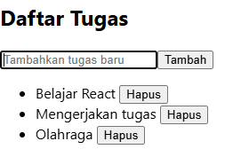
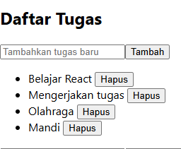
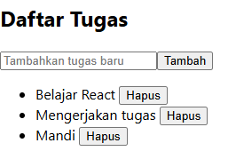

Berikut adalah versi yang lebih rapi dan profesional dari jawaban tugas Anda:  

---

# **Getting Started with Create React App**  
Proyek ini dibuat menggunakan [Create React App](https://github.com/facebook/create-react-app).  

## **Available Scripts**  
- `npm install` – Menginstal dependency aplikasi yang dibutuhkan.  
- `npm start` – Menjalankan aplikasi di mode pengembangan.  
- `npm test` – Menjalankan pengujian.  
- `npm run build` – Membangun aplikasi untuk produksi.  
- `npm run eject` – Menghapus dependensi build bawaan (tidak dapat dikembalikan).  

## **Dokumentasi**  

- 📘 [Create React App Docs](https://facebook.github.io/create-react-app/docs/getting-started)  
- ⚛️ [React Docs](https://reactjs.org/)  

---

## **Identitas**  

|  | Pemrograman Berbasis Framework 2025 |  
|--|--|  
| **NIM** | 2241720203 |  
| **Nama** | Moch Reynald Silva Baktiar |  
| **Kelas** | TI - 3A |  

---

## **Jawaban Tugas**  

### **1. Buat komponen `TodoList` dengan State dan Props**  
✅ **Kode:**  
```jsx
function TodoItem({ task, onDelete }) {
  return (
    <li>
      {task} <button onClick={onDelete}>Hapus</button>
    </li>
  );
}

function TodoList() {
  const [tasks, setTasks] = useState(["Belajar React", "Mengerjakan tugas", "Olahraga"]);

  return (
    <div>
      <h2>To Do List</h2>
      <ul>
        {tasks.map((task, index) => (
          <TodoItem key={index} task={task} onDelete={() => {}} />
        ))}
      </ul>
    </div>
  );
}
```

---

### **2. Tambahkan fitur untuk menambahkan tugas baru**  
✅ **Kode:**  
```jsx
const [newTask, setNewTask] = useState("");

const addTask = () => {
  if (newTask.trim() !== "") {
    setTasks([...tasks, newTask]);
    setNewTask("");
  }
};

<input 
  type="text" 
  value={newTask} 
  onChange={(e) => setNewTask(e.target.value)} 
  placeholder="Tambahkan tugas baru" 
/>
<button onClick={addTask}>Tambah</button>
```

---

### **3. Implementasikan fitur untuk menghapus tugas**  
✅ **Kode:**  
```jsx
const deleteTask = (index) => {
  setTasks(tasks.filter((_, i) => i !== index));
};

<TodoItem key={index} task={task} onDelete={() => deleteTask(index)} />
```

---

## **Source Code Lengkap (`TodoList.js`)**  
```jsx
import React, { useState } from 'react';

function TodoItem({ task, onDelete }) {
  return (
    <li>
      {task} <button onClick={onDelete}>Hapus</button>
    </li>
  );
}

function TodoList() {
  const [tasks, setTasks] = useState(["Belajar React", "Mengerjakan tugas", "Olahraga"]);
  const [newTask, setNewTask] = useState("");

  const addTask = () => {
    if (newTask.trim() !== "") {
      setTasks([...tasks, newTask]);
      setNewTask("");
    }
  };

  const deleteTask = (index) => {
    setTasks(tasks.filter((_, i) => i !== index));
  };

  return (
    <div>
      <h2>To Do List</h2>
      <input 
        type="text" 
        value={newTask} 
        onChange={(e) => setNewTask(e.target.value)} 
        placeholder="Tambahkan tugas baru" 
      />
      <button onClick={addTask}>Tambah</button>
      <ul>
        {tasks.map((task, index) => (
          <TodoItem key={index} task={task} onDelete={() => deleteTask(index)} />
        ))}
      </ul>
    </div>
  );
}

export default TodoList;
```
### **Screenshot**  

- **Sebelum menambahkan dan menghapus:**  
    

- **Menambahkan List (Menambahkan "Mandi")**  
    

- **Menghapus List (Menghapus "Olahraga")**  
    
