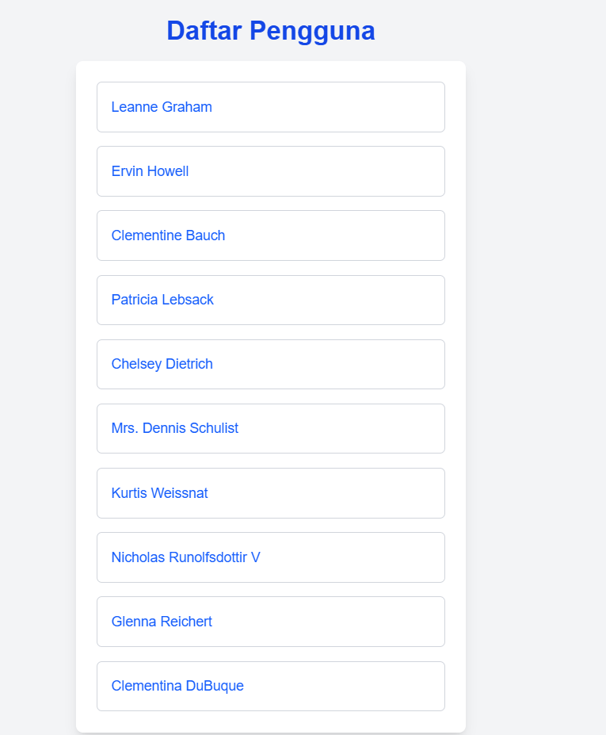
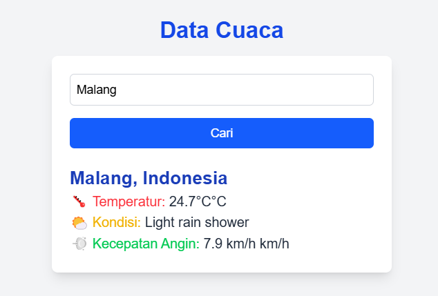

# **Getting Started with Create React App**  
Proyek ini dibuat menggunakan [Create React App](https://github.com/facebook/create-react-app).  

## **Available Scripts**  

- `npm start` – Menjalankan aplikasi di mode pengembangan.  
- `npm test` – Menjalankan pengujian.  
- `npm run build` – Membangun aplikasi untuk produksi.  
- `npm run eject` – Menghapus dependensi build bawaan (tidak dapat dikembalikan).  

## **Dokumentasi**  

- 📘 [Create React App Docs](https://facebook.github.io/create-react-app/docs/getting-started)  
- ⚛️ [React Docs](https://reactjs.org/)  

---

## **Identitas**  

|  | Pemrograman Berbasis Framework 2025 |  
|--|--|  
| **NIM** | 2241720203 |  
| **Nama** | Moch Reynald Silva Baktiar |  
| **Kelas** | TI - 3A |  

---

## **Jawaban Tugas**  
Berikut adalah implementasi tugas yang sudah disesuaikan dengan perubahan terbaru, termasuk penggunaan **WeatherAPI** untuk cuaca.  

---

## **1. Halaman Pengguna dengan Static Site Generation (SSG)**
Buat file **`pages/users.js`** untuk menampilkan daftar pengguna menggunakan **SSG**:  

```jsx
export async function getStaticProps() {
    const res = await fetch("https://jsonplaceholder.typicode.com/users");
    const users = await res.json();
  
    return {
      props: { users },
      revalidate: 60
    };
  }
  
  export default function Users({ users }) {
    return (
      <div className="flex flex-col items-center justify-center min-h-screen bg-gray-100 p-4">
        <h1 className="text-3xl font-bold text-blue-700 mb-4">Daftar Pengguna</h1>
        <div className="bg-white shadow-lg rounded-lg p-6 w-full max-w-md">
          <ul className="space-y-4">
            {users.map((user) => (
              <li key={user.id} className="p-4 border border-gray-300 rounded-md hover:bg-blue-100 transition">
                <a href={`/users/${user.id}`} className="text-blue-600 font-medium hover:underline">
                  {user.name}
                </a>
              </li>
            ))}
          </ul>
        </div>
      </div>
    );
  }
```

---

## **2. Halaman Detail Pengguna dengan Dynamic Routes**
Buat folder **`pages/users/`**, lalu buat file **`[id].js`** untuk menampilkan detail pengguna berdasarkan ID:  

```jsx
export async function getStaticPaths() {
    const res = await fetch("https://jsonplaceholder.typicode.com/users");
    const users = await res.json();
  
    const paths = users.map((user) => ({
      params: { id: user.id.toString() },
    }));
  
    return { paths, fallback: false };
  }
  
  export async function getStaticProps({ params }) {
    const res = await fetch(
      `https://jsonplaceholder.typicode.com/users/${params.id}`
    );
    const user = await res.json();
  
    return { props: { user } };
  }
  
  export default function UserDetail({ user }) {
    return (
      <div className="flex flex-col items-center justify-center min-h-screen bg-gray-100 p-4">
        <h1 className="text-3xl font-bold text-blue-700 mb-4">{user.name}</h1>
        <div className="bg-white shadow-lg rounded-lg p-6 w-full max-w-md">
          <p className="text-lg text-gray-800"><span className="font-semibold text-blue-600">📧 Email:</span> {user.email}</p>
          <p className="text-lg text-gray-800"><span className="font-semibold text-green-600">📞 Phone:</span> {user.phone}</p>
          <p className="text-lg text-gray-800"><span className="font-semibold text-purple-600">🌐 Website:</span> <a href={`https://${user.website}`} className="text-blue-500 hover:underline" target="_blank" rel="noopener noreferrer">{user.website}</a></p>
        </div>
        <a href="/users" className="mt-4 text-blue-600 hover:underline">⬅ Kembali ke daftar pengguna</a>
      </div>
    );
  } 
```
---

## 📌 **3. API Route untuk Data Cuaca**
Buat folder **`pages/api/`**, lalu buat file **`weather.js`** untuk mengambil data cuaca dari **WeatherAPI**:  

```javascript
export default async function handler(req, res) {
    const city = req.query.city || "Malang"; // Default ke Malang jika parameter tidak ada di isi
    const API_KEY = "_API_KEY_MU_"; // Ganti dengan API Key dari WeatherAPI
    const url = `http://api.weatherapi.com/v1/current.json?key=${API_KEY}&q=${city}&lang=id`;
  
    try {
      const response = await fetch(url);
      const data = await response.json();
  
      if (response.status !== 200 || data.error) {
        return res.status(400).json({ error: "Kota tidak ditemukan" });
      }
  
      res.status(200).json({
        city: data.location.name,
        country: data.location.country,
        temperature: `${data.current.temp_c}°C`,
        condition: data.current.condition.text,
        windspeed: `${data.current.wind_kph} km/h`,
      });
    } catch (error) {
      res.status(500).json({ error: "Terjadi kesalahan server" });
    }
  }
  
```
---

## 📌 **4. Halaman Front-End untuk Menampilkan Data Cuaca**
Buat file **`pages/weather.js`** untuk menampilkan data cuaca di frontend:  

```jsx
import { useState } from "react";

export default function Weather() {
  const [city, setCity] = useState("");
  const [weather, setWeather] = useState(null);
  const [error, setError] = useState(null);

  async function fetchWeather() {
    if (!city) {
      setError("Silakan masukkan nama kota!");
      return;
    }

    setError(null);
    try {
      const res = await fetch(`/api/weather?city=${city}`);
      const data = await res.json();

      if (res.ok) {
        setWeather(data);
      } else {
        setWeather(null);
        setError(data.error);
      }
    } catch (err) {
      setWeather(null);
      setError("Gagal mengambil data cuaca.");
    }
  }


  return (
    <div className="flex flex-col items-center justify-center min-h-screen bg-gray-100 p-4">
      <h1 className="text-3xl font-bold text-blue-700 mb-4">Data Cuaca</h1>
      <div className="bg-white shadow-lg rounded-lg p-6 w-full max-w-md">
        <input
          type="text"
          placeholder="Masukkan nama kota"
          value={city}
          onChange={(e) => setCity(e.target.value)}
          className="w-full p-2 border border-gray-300 rounded-md focus:outline-none focus:ring-2 focus:ring-blue-500 mb-4 text-black"
        />
        <button
          onClick={fetchWeather}
          className="w-full bg-blue-600 text-white p-2 rounded-md hover:bg-blue-700 transition"
        >
          Cari
        </button>

        {error && <p className="text-red-600 mt-4">{error}</p>}

        {weather && (
          <div className="mt-6 text-gray-800">
            <h2 className="text-2xl font-semibold text-blue-800">
              {weather.city}, {weather.country}
            </h2>
            <p className="text-lg">🌡️ <span className="font-medium text-red-500">Temperatur:</span> {weather.temperature}°C</p>
            <p className="text-lg">🌤️ <span className="font-medium text-yellow-500">Kondisi:</span> {weather.condition}</p>
            <p className="text-lg">💨 <span className="font-medium text-green-500">Kecepatan Angin:</span> {weather.windspeed} km/h</p>
          </div>
        )}
      </div>
    </div>
  );
}
```
---

## 🎯 **Hasil :**
1. **Buka halaman-halaman berikut di browser:**  
   - **Daftar pengguna:** [http://localhost:3000/users](http://localhost:3000/users)  
       
   
   - **Detail pengguna:** [http://localhost:3000/users/1](http://localhost:3000/users/1)  
       
   - **Data cuaca:** [http://localhost:3000/weather](http://localhost:3000/weather)  
       


---

### ✅ **Hasil yang diharapkan : **  
✔ **SSG** untuk daftar pengguna  
✔ **Dynamic Routes** untuk detail pengguna  
✔ **API Route** untuk data cuaca dari WeatherAPI  
✔ **Frontend cuaca** dengan input nama kota  

